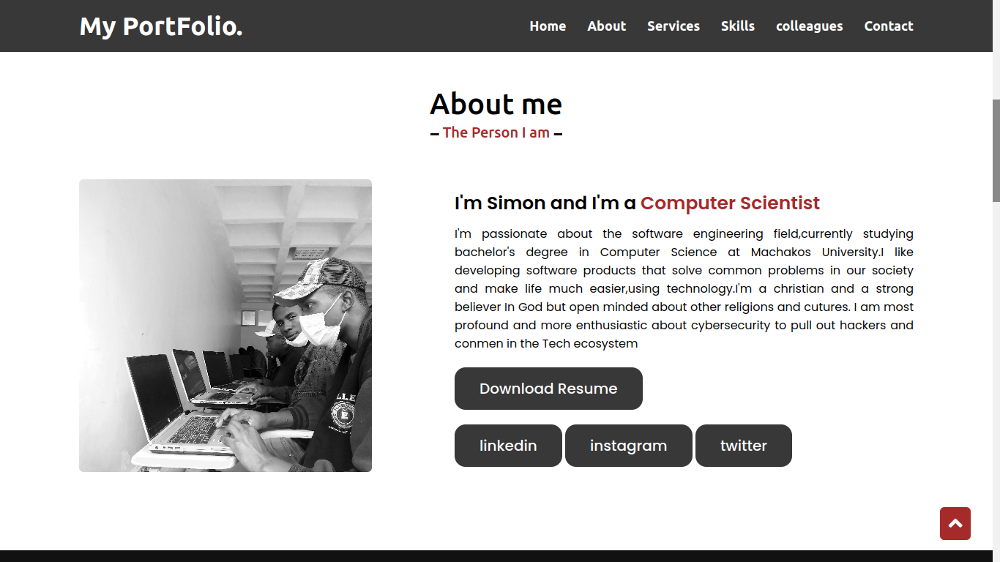

<h1>Hey, 👋 I am Mburu Njoroge  </h1>

I am a full-stack developer who enjoy writing computer programs ✌

<!--  -->

<a href="https://mburunjoroge.netlify.app/">
  &nbsp;
 <!-- wi*quL3fcV -->
  </a>

<!--  -->

<!-- <h2>About Me</h2>
<h4>Developer & Designer</h4>

  Currently, my main focus is finding reliable solutions for software issues. I am fluent in English and accustomed to working with cross-cultural, global terms.

I am currently a final year student at Machakos university studying Computer science.
 -->
<h2>🚀 Some Tools I Use</h2>

  
<!--  

  -->
 
 ## contact me:
 
 

  

